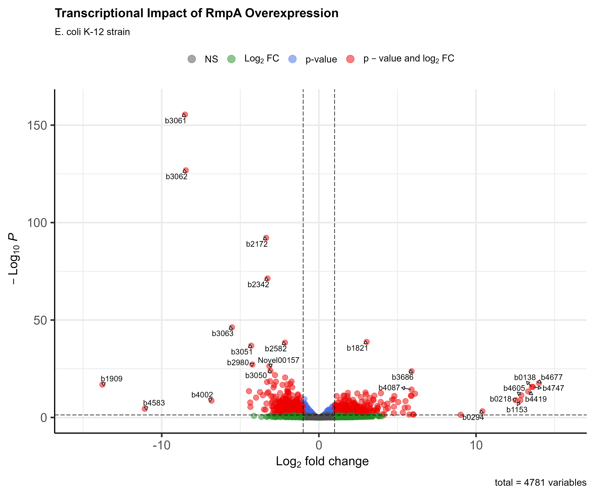
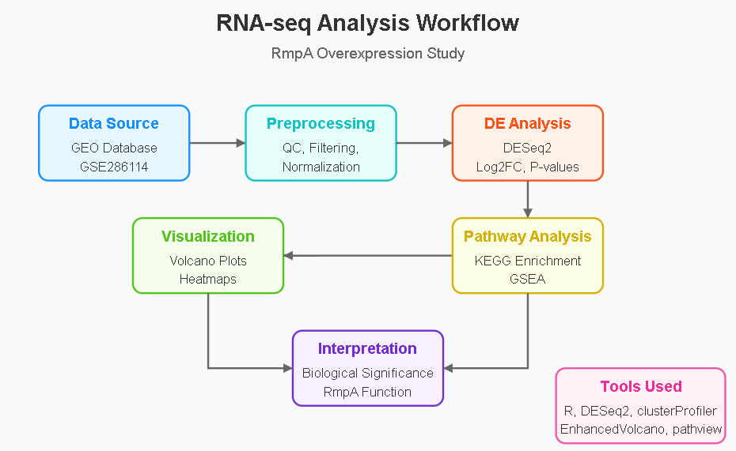
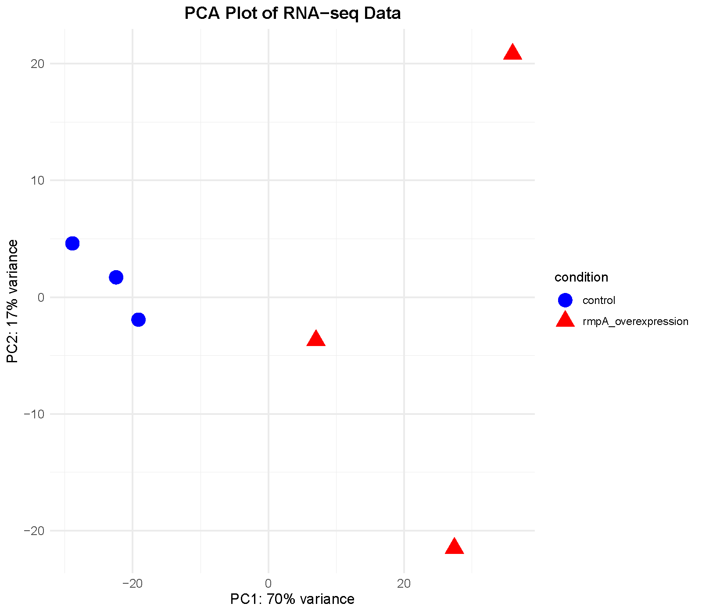
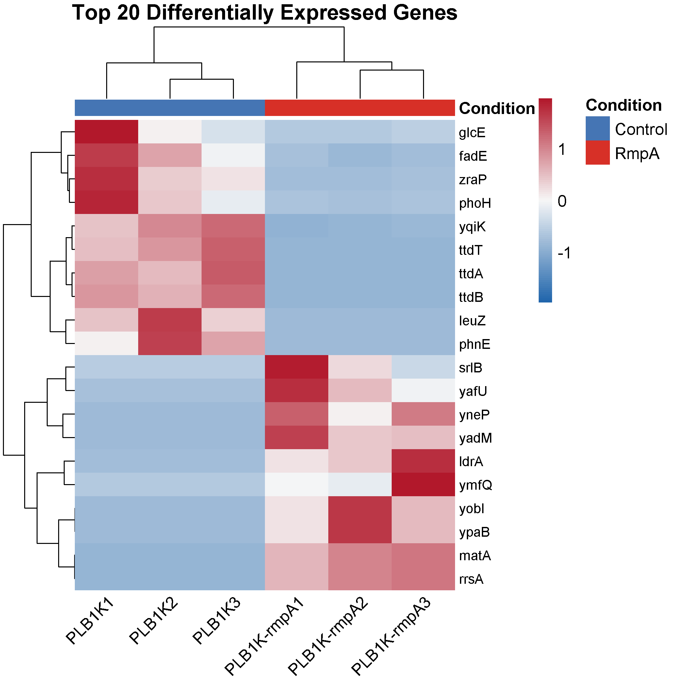
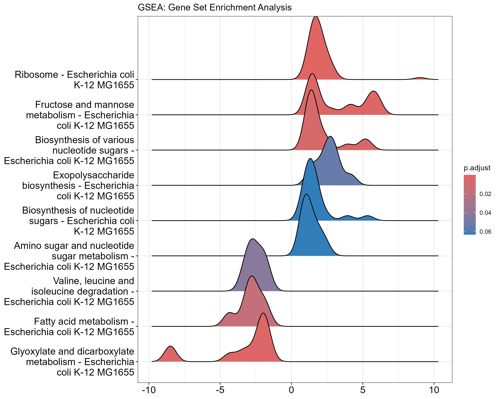
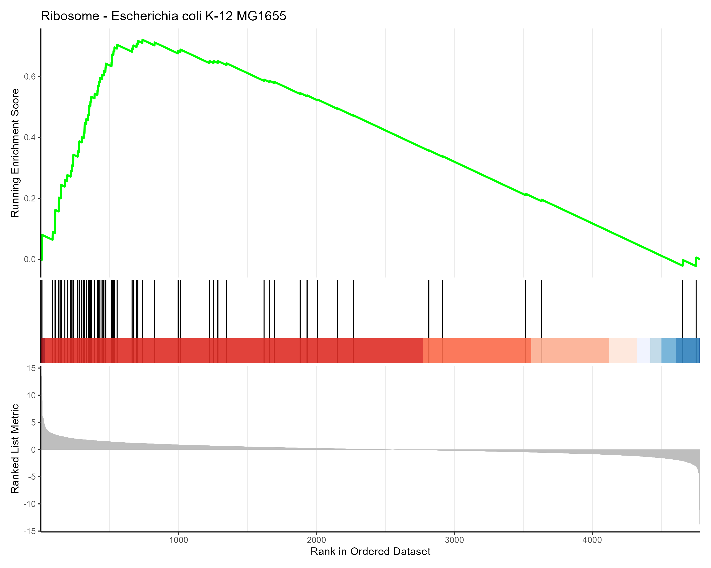
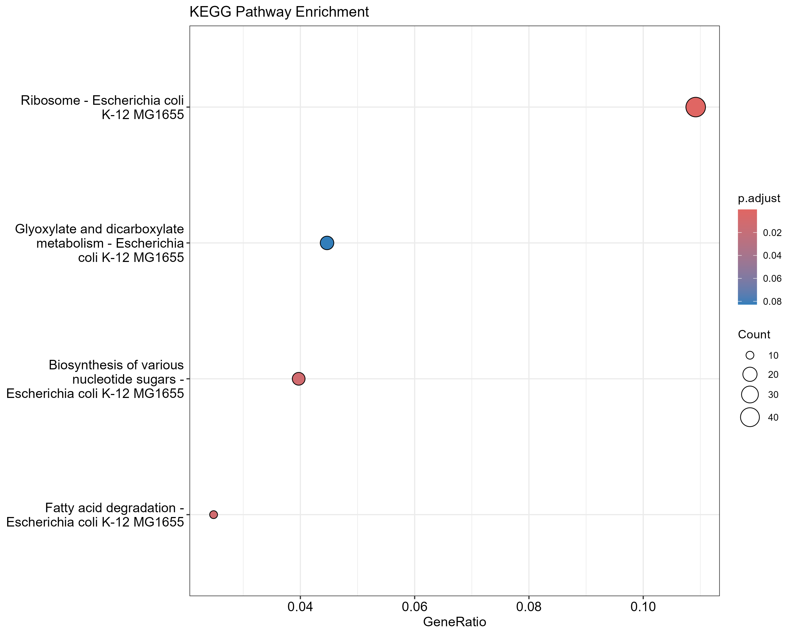

# Transcriptional Analysis of RmpA-Mediated Regulation in Bacteria

## Overview



This project investigates the transcriptional response of *Escherichia coli* to RmpA overexpression using RNA-Sequencing data. RmpA (Regulator of Mucoid Phenotype A) is a transcriptional regulator known to influence capsule production and biofilm formation in *Klebsiella pneumoniae*. By studying its effects in *E. coli*, we gain insights into conserved regulatory mechanisms across bacterial species.

## Workflow



1. **Data Acquisition**: RNA-seq dataset (GSE286114) from GEO database
2. **Preprocessing**: Quality control, filtering, and normalization
3. **Differential Expression Analysis**: DESeq2 analysis comparing RmpA overexpression vs. control
4. **Pathway Analysis**: KEGG pathway enrichment using clusterProfiler
5. **Visualization**: Volcano plots, heatmaps, and pathway diagrams

## Data Preprocessing



The RNA-seq data analysis began with comprehensive preprocessing to ensure data quality and reliability:

### Data Acquisition and Quality Control
* **Data Source**: RNA-seq dataset GSE286114 from GEO database
* **Sample Information**: 3 biological replicates per condition
* **Initial QC**: Raw count distributions were examined to identify potential outliers and assess sequencing depth

### Filtering and Normalization
* **Filtering Strategy**: Low-count genes were removed (minimum 10 counts in at least 3 samples)
* **Result**: 4,781 genes retained (95.4% of initial genes)
* **Normalization**: DESeq2 size factor normalization to account for library size differences

### Quality Assessment 
* **PCA Analysis**: Clear separation between conditions along PC1 (70% variance)
* **Sample Correlation**: High within-group correlation demonstrating good reproducibility
* **Biological Signal**: Strong transcriptional signature of RmpA overexpression evident in exploratory analysis

## Key Findings

### 1. Differential Expression



* **1,515 genes** significantly differentially expressed (FDR < 0.05)
* **769 genes (16%)** significantly up-regulated 
* **746 genes (16%)** significantly down-regulated
* **1,055 genes** met stricter biological relevance criteria (|log2FC| > 1) for pathway analysis

**Note on Gene Filtering:** While initial differential expression analysis identified 1,515 genes with adjusted p-value < 0.05, pathway analysis focused on 1,055 genes that met both statistical significance (padj < 0.05) AND biological relevance criteria (|log2FoldChange| > 1).

### 2. Pathway Enrichment



| Pathway | Description | p-value | Status |
|---------|-------------|---------|--------|
| eco03010 | Ribosome | 5.01e-11 | Upregulated |
| eco00541 | Biosynthesis of nucleotide sugars | 2.58e-06 | Upregulated |
| eco00630 | Glyoxylate and dicarboxylate metabolism | 3.74e-03 | Downregulated |
| eco00071 | Fatty acid degradation | 3.38e-04 | Downregulated |

GSEA analysis confirmed these findings, with strong enrichment scores for ribosomal and nucleotide sugar pathways.



### 3. Biological Significance

* **Ribosome Biogenesis**: Strong upregulation suggests increased protein synthesis capacity
* **Exopolysaccharide Production**: Changes in nucleotide sugar biosynthesis pathways indicate altered cell surface properties
* **Metabolic Reprogramming**: Downregulation of fatty acid metabolism suggests energy redirection
* **Potential Biofilm Connection**: Several biofilm-related genes show altered expression



The transcriptional changes induced by RmpA overexpression align with its known role in *Klebsiella pneumoniae* as a regulator of capsule production and biofilm formation, suggesting conserved mechanisms across related bacterial species.

## Reproduction

### Prerequisites
- R (version 4.0+)
- Required packages: DESeq2, tidyverse, pheatmap, EnhancedVolcano, pathview, clusterProfiler

### Running the Analysis
1. Clone this repository
```bash
git clone https://github.com/yourusername/bioinformatics-portfolio.git
cd bioinformatics-portfolio/projects/rna-seq-analysis
```

2. Run the preprocessing script
```bash
Rscript R/preprocessing.R
```

3. Generate the analysis report
```bash
Rscript -e "rmarkdown::render('analysis.Rmd', output_file='../reports/analysis.html')"
```

For complete methodology and detailed findings, see the [full analysis document](./analysis.html).

## Contact
Email: vigneshwaran0594@gmail.com