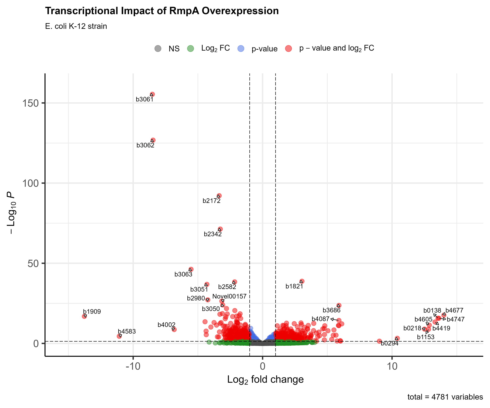
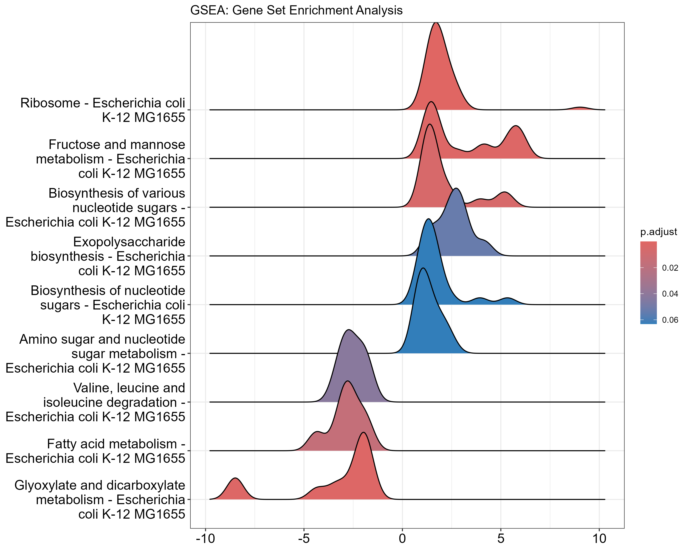

# Transcriptional Analysis of RmpA-Mediated Regulation in Bacteria

## Overview

<p align="center">
  
</p>

This project investigates the transcriptional response of *Escherichia coli* to RmpA overexpression using RNA-Sequencing data. RmpA (Regulator of Mucoid Phenotype A) is a transcriptional regulator known to influence capsule production and biofilm formation in *Klebsiella pneumoniae*. By studying its effects in *E. coli*, we gain insights into conserved regulatory mechanisms across bacterial species.

## Workflow

<p align="center">
  
</p>

1. **Data Acquisition**: RNA-seq dataset (GSE286114) from GEO database
2. **Preprocessing**: Quality control, filtering, and normalization
3. **Differential Expression Analysis**: DESeq2 analysis comparing RmpA overexpression vs. control
4. **Pathway Analysis**: KEGG pathway enrichment using clusterProfiler
5. **Visualization**: Volcano plots, heatmaps, and pathway diagrams

## Data Preprocessing

The RNA-seq data analysis began with comprehensive preprocessing to ensure data quality and reliability:

### Data Acquisition and Quality Control
* **Data Source**: RNA-seq dataset GSE286114 from GEO database
* **Sample Information**: 3 biological replicates per condition
* **Initial QC**: Raw count distributions were examined to identify potential outliers and assess sequencing depth

<p align="center">
  
  <br><em>Distribution of gene counts before and after filtering</em>
</p>

### Filtering and Normalization
* **Filtering Strategy**: Low-count genes were removed (minimum 10 counts in at least 3 samples)
* **Result**: 4,781 genes retained (95.4% of initial genes)
* **Normalization**: DESeq2 size factor normalization to account for library size differences

<p align="center">
  
  <br><em>Sample correlation heatmap showing clear separation between conditions</em>
</p>

### Quality Assessment 
* **PCA Analysis**: Clear separation between conditions along PC1 (70% variance)
* **Sample Correlation**: High within-group correlation demonstrating good reproducibility
* **Biological Signal**: Strong transcriptional signature of RmpA overexpression evident in exploratory analysis

<p align="center">
  
  <br><em>Principal Component Analysis showing distinct clustering by experimental condition</em>
</p>

## Key Findings

### 1. Differential Expression

<p align="center">
  
  <br><em>Heatmap of top 20 differentially expressed genes showing distinct expression patterns</em>
</p>

* **1,515 genes** significantly differentially expressed (FDR < 0.05)
* **769 genes (16%)** significantly up-regulated 
* **746 genes (16%)** significantly down-regulated
* **1,055 genes** met stricter biological relevance criteria (|log2FC| > 1) for pathway analysis

**Note on Gene Filtering:** While initial differential expression analysis identified 1,515 genes with adjusted p-value < 0.05, pathway analysis focused on 1,055 genes that met both statistical significance (padj < 0.05) AND biological relevance criteria (|log2FoldChange| > 1).

### 2. Pathway Enrichment

<p align="center">
  
  <br><em>GSEA ridgeplot showing enrichment of key pathways</em>
</p>

| Pathway | Description | p-value | Status |
|---------|-------------|---------|--------|
| eco03010 | Ribosome | 5.01e-11 | Upregulated |
| eco00541 | Biosynthesis of nucleotide sugars | 2.58e-06 | Upregulated |
| eco00630 | Glyoxylate and dicarboxylate metabolism | 3.74e-03 | Downregulated |
| eco00071 | Fatty acid degradation | 3.38e-04 | Downregulated |

GSEA analysis confirmed these findings, with strong enrichment scores for ribosomal and nucleotide sugar pathways.

<p align="center">
  
  <br><em>Detailed GSEA enrichment plot for the ribosome pathway</em>
</p>

### 3. Biological Significance

<p align="center">
  
  <br><em>Dotplot of enriched KEGG pathways, with dot size indicating gene count and color indicating significance</em>
</p>

* **Ribosome Biogenesis**: Strong upregulation suggests increased protein synthesis capacity
* **Exopolysaccharide Production**: Changes in nucleotide sugar biosynthesis pathways indicate altered cell surface properties
* **Metabolic Reprogramming**: Downregulation of fatty acid metabolism suggests energy redirection
* **Potential Biofilm Connection**: Several biofilm-related genes show altered expression

The transcriptional changes induced by RmpA overexpression align with its known role in *Klebsiella pneumoniae* as a regulator of capsule production and biofilm formation, suggesting conserved mechanisms across related bacterial species.

## Reproduction

### Prerequisites
- R (version 4.0+)
- Required packages: DESeq2, tidyverse, pheatmap, EnhancedVolcano, pathview, clusterProfiler

### Running the Analysis
1. Clone this repository
```bash
git clone https://github.com/yourusername/bioinformatics-portfolio.git
cd bioinformatics-portfolio/projects/rna-seq-analysis
```

2. Run the preprocessing script
```bash
Rscript R/preprocessing.R
```

3. Generate the analysis report
```bash
Rscript -e "rmarkdown::render('analysis.Rmd', output_file='../reports/analysis.html')"
```

For complete methodology and detailed findings, see the [full analysis document](https://vikos77.github.io/bioinformatics-portfolio/projects/rna-seq-analysis/analysis.html).

## References

### Dataset
1. Yao S, Huang J, Geng J, Wei D, Wang C, Song Y, Zhang G, Feng J. (2023). RmpA as a Global Regulator Modulates Switching Between Hypermucoviscosity and Biofilm in Hypervirulent Klebsiella pneumoniae [RNA-seq]. Gene Expression Omnibus. GSE286114. https://www.ncbi.nlm.nih.gov/geo/query/acc.cgi?acc=GSE286114

### Methods and Tools
2. Love MI, Huber W, Anders S. (2014). Moderated estimation of fold change and dispersion for RNA-seq data with DESeq2. Genome Biology, 15(12), 550. https://doi.org/10.1186/s13059-014-0550-8

3. Yu G, Wang LG, Han Y, He QY. (2012). clusterProfiler: an R package for comparing biological themes among gene clusters. OMICS: A Journal of Integrative Biology, 16(5), 284-287. https://doi.org/10.1089/omi.2011.0118

4. Wickham H. (2016). ggplot2: Elegant Graphics for Data Analysis. Springer-Verlag New York. ISBN 978-3-319-24277-4.

### Related Research on RmpA

5. Walker KA, Miller VL. (2020). The intersection of capsule gene expression, hypermucoviscosity and hypervirulence in Klebsiella pneumoniae. Current Opinion in Microbiology, 54, 95-102. https://doi.org/10.1016/j.mib.2020.01.006

6. Paczosa MK, Mecsas J. (2016). Klebsiella pneumoniae: Going on the Offense with a Strong Defense. Microbiology and Molecular Biology Reviews, 80(3), 629-661. https://doi.org/10.1128/MMBR.00078-15 

7. Cheng HY, Chen YS, Wu CY, Chang HY, Lai YC, Peng HL. (2010). RmpA regulation of capsular polysaccharide biosynthesis in Klebsiella pneumoniae CG43. Journal of Bacteriology, 192(12), 3144-3158. https://doi.org/10.1128/JB.00031-10

### E. coli as a Model System

8. Browning DF, Butala M, Busby SJW. (2019). Bacterial Transcription Factors: Regulation by Pick "N" Mix. Journal of Molecular Biology, 431(20), 4067-4077. https://doi.org/10.1016/j.jmb.2019.04.011

9. Beloin C, Roux A, Ghigo JM. (2008). Escherichia coli biofilms. Current Topics in Microbiology and Immunology, 322, 249-289. https://doi.org/10.1007/978-3-540-75418-3_12

## Contact
Email: vigneshwaran0594@gmail.com